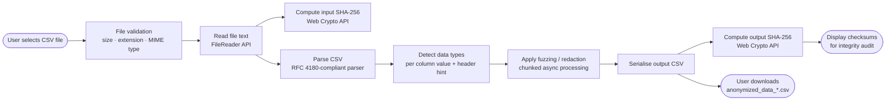

# CSV Anonymizer

Anonymize your CSV files directly in your browser with this static web application. Preserve valuable data structure while intelligently fuzzing or redacting sensitive information to protect privacy.

[](https://fabriziosalmi.github.io/csv-anonymizer/)

## 🗂️ Project Overview

CSV Anonymizer is a **100% client-side, serverless** web application built with vanilla JavaScript (ES2020+) and Bootstrap 5. Its purpose is to let individuals and organisations anonymize CSV datasets—replacing or fuzzing personally identifiable information (PII)—without ever uploading the data to a third-party server.

Key design goals:
- **Privacy-first**: all processing happens inside the user's browser; no data leaves the device.
- **Type-aware anonymization**: the tool detects data types (numbers, dates, e-mails, URLs, phone numbers, geographic coordinates, addresses, identifiers, and free-text strings) and applies the most appropriate fuzzing or redaction strategy.
- **Configurable**: three preset anonymization levels (Mild / Moderate / Aggressive) plus a fully customisable Advanced mode.
- **Integrity-verifiable**: SHA-256 checksums of both the original and anonymized files are displayed so that downstream consumers can verify output integrity.

## 🏗️ Architecture



## Screenshots


---

## ✨ Key Features

*   **🔒 Client-Side Privacy:** Your data remains completely private. All CSV processing and anonymization happens directly within your web browser, ensuring no data is transmitted to any server.
*   **🗂️ Structure Preserved:**  Maintain the integrity of your CSV files. The anonymizer intelligently modifies data *within* the existing structure, keeping columns and formatting consistent.
*   **🤩 Type-Aware Fuzzing & Redaction:**  Go beyond simple string replacement. This tool understands different data types (Numbers, Dates, Emails, URLs, YouTube URLs, Geographic Coordinates, Addresses, IDs, and general Strings) and applies appropriate anonymization techniques to each.
*   **🛠️ Highly Configurable Anonymization:**
    *   **Presets for Convenience:** Choose from "Mild," "Moderate," or "Aggressive" presets for quick and easy anonymization levels.
    *   **Advanced Customization:** Unlock granular control with the "Advanced Fuzzing Configuration" panel. Fine-tune redaction and fuzzing parameters for each data type to meet your specific anonymization requirements.
*   **🛡️ Static & Serverless Application:**  Benefit from a secure and reliable tool. As a static web application, it operates entirely in your browser without relying on any backend server, eliminating data transmission and server-side vulnerabilities.
*   **🚀 Fast and Efficient:**  Experience quick anonymization directly in your browser, without delays associated with uploading and downloading data to external servers.

## 🚀 How to Use

1.  **Access the CSV Anonymizer:**
    *   **Open Online:**  Simply navigate to [https://fabriziosalmi.github.io/csv-anonymizer/](https://fabriziosalmi.github.io/csv-anonymizer/) using your preferred web browser.
    *   **Use Offline (Local Execution):** For enhanced privacy or offline use, you can [download the application as a ZIP archive](https://github.com/fabriziosalmi/csv-anonymizer/archive/refs/heads/main.zip). Extract the `csv-anonymizer-main.zip` archive to a folder on your computer. Then, open the `index.html` file directly in your browser (e.g., by double-clicking the file, or using "File > Open" from your browser's menu).
2.  **Upload Your CSV File:** Locate the "Choose File" button within the application. Click it and select the `.csv` file from your local computer that you intend to anonymize. The tool accepts standard comma-separated CSV files.
3.  **Configure the Anonymization Process (Recommended):**
    *   **Select a Fuzzing Preset (Quick Setup):** For users seeking a fast and straightforward approach, use the "Fuzzing Preset" dropdown menu. Choose from three pre-defined levels:
        *   **Mild Anonymization:** Applies subtle fuzzing, ideal for scenarios where data utility is paramount and minimal anonymization is needed.
        *   **Moderate Anonymization:**  A balanced approach, offering a good level of privacy while preserving reasonable data accuracy. Suitable for general anonymization needs.
        *   **Aggressive Anonymization:**  Maximizes privacy by applying stronger fuzzing and redaction. Use this for highly sensitive data where anonymity is critical, even at the cost of some data granularity.
        *   **Custom:** Select "Custom" if you wish to manually configure all anonymization parameters.
    *   **Advanced Fuzzing Configuration (Granular Control):** For fine-grained control over the anonymization process, click the "Advanced Fuzzing Configuration (Optional)" button to expand the advanced settings panel. Here, you can customize:
        *   **Redact Numbers:** Check the "Redact Numbers" checkbox to replace all detected numerical values in your CSV with the text `REDACTED`. Uncheck to apply fuzzing to numbers instead.
        *   **Number Fuzz Factor:**  When number redaction is disabled, use the "Number Fuzz Factor" slider to control the intensity of number fuzzing. A higher value introduces larger variations to the original numbers.
        *   **Redact Dates:** Check "Redact Dates" to replace date values with `REDACTED`. Uncheck to enable date fuzzing.
        *   **Date Variation Range (Days):**  If date redaction is off, set the "Date Variation Range (Days)" to define the maximum number of days dates can be randomly varied by (both +/-).
        *   **Redact Strings (General):**  Enable "Redact Strings (General)" to replace all general string values with `REDACTED`. Uncheck to apply fuzzing to general strings.
        *   **String Fuzz Probability (General):** When general string redaction is disabled, use the "String Fuzz Probability (General)" slider to adjust the probability of fuzzing for general text strings. A higher probability means more characters in strings will be fuzzed (modified).
        *   **Redact Strings (Light):**  Check "Redact Strings (Light)" to redact values identified as "light strings" (e.g., IDs, codes) with `REDACTED`. Uncheck to apply light fuzzing to these strings.
        *   **String Fuzz Probability (Light):**  When light string redaction is off, use the "String Fuzz Probability (Light)" slider to control the fuzzing probability for light strings. Light fuzzing is designed to be less disruptive, suitable for IDs and codes where format preservation is desired.

4.  **Initiate Anonymization:** Once you have uploaded your CSV file and configured the anonymization settings to your liking (or chosen a preset), click the prominent "Fuzz & Anonymize" button. The application will begin processing your CSV data in your browser. A "Processing... Please wait." message will be displayed temporarily.
5.  **Download Your Anonymized CSV:** Upon completion of the anonymization process, the "Processing..." message will disappear, and a "Download Fuzzed CSV" button will appear. Click this button to download the anonymized version of your CSV file. The downloaded file will be named `fuzzed_data.csv` and will be saved to your computer's default download location.
6.  **Securely Share Your Data:** The downloaded `fuzzed_data.csv` file now contains the anonymized version of your data. You can confidently share this file, knowing that sensitive information has been processed according to your chosen settings, protecting the privacy of individuals while retaining the structural and analytical value of your dataset.

## ⚙️ Customization Options - In Detail

*   **Fuzzing Presets:** For users who need a quick start or want to apply standard anonymization levels, presets are the easiest option. Choose from:
    *   **Mild:**  Applies minimal fuzzing, primarily for light strings and small number variations. Redaction is generally disabled. Best for low-sensitivity data or when data utility is paramount.
    *   **Moderate:**  A balanced preset with moderate fuzzing applied to numbers, dates, and strings. No redaction by default. A good general-purpose anonymization level.
    *   **Aggressive:**  Applies heavy fuzzing and enables redaction for numbers, dates, and strings.  Suitable for highly sensitive data requiring strong anonymization.
    *   **Custom:**  Select "Custom" to disable presets and manually configure all individual settings. This provides maximum flexibility to tailor the anonymization process.

*   **Advanced Configuration Parameters:**  For users who require precise control, the "Advanced Fuzzing Configuration" section offers individual parameters for each data type:
    *   **Redact Numbers (Checkbox):**  Globally enables or disables redaction for all detected numerical values. When checked, numbers are replaced with `REDACTED`. When unchecked, numbers are fuzzed based on the "Number Fuzz Factor."
    *   **Number Fuzz Factor (Slider):**  Controls the intensity of number fuzzing. Values range from 0 (no fuzzing) to 1 (high fuzzing). Higher values introduce larger random variations to numbers.
    *   **Redact Dates (Checkbox):**  Enables or disables redaction for all detected dates. When checked, dates are replaced with `REDACTED`. When unchecked, dates are fuzzed based on "Date Variation Range (Days)."
    *   **Date Variation Range (Days) (Number Input):**  Defines the maximum range (in days) by which dates can be randomly varied (both forwards and backwards in time).
    *   **Redact Strings (General) (Checkbox):**  Enables or disables redaction for general text strings (those not identified as specific types like emails or URLs). When checked, general strings are replaced with `REDACTED`. When unchecked, general strings are fuzzed based on "String Fuzz Probability (General)."
    *   **String Fuzz Probability (General) (Slider):** Controls the probability of applying fuzzing operations (insertion, deletion, substitution, transposition, repetition) to general text strings. Higher values increase the likelihood of fuzzing.
    *   **Redact Strings (Light) (Checkbox):** Enables or disables redaction for "light strings," which are typically short, identifier-like strings (e.g., IDs, codes). When checked, light strings are replaced with `REDACTED`. When unchecked, light strings are fuzzed using "String Fuzz Probability (Light)."
    *   **String Fuzz Probability (Light) (Slider):** Controls the probability of applying *light* fuzzing operations (substitution, transposition, case flipping - length-preserving) to light strings. Designed to be less disruptive than general string fuzzing, preserving the format and length of identifiers.

*   **Redaction vs. Fuzzing Strategy:**
    *   **Redaction:**  Completely removes the original data value, replacing it with `REDACTED`. This provides strong anonymization but sacrifices data utility for those specific fields. Use redaction for highly sensitive columns where revealing any variation of the original data is unacceptable.
    *   **Fuzzing:**  Modifies the original data value by introducing small, controlled random variations. Fuzzing aims to preserve the statistical properties and overall distribution of the data while making individual values less identifiable. Choose fuzzing when you need to maintain data utility for analysis and reporting but still want to anonymize the dataset.

## 🔐 Security

### Security controls (aligned with OWASP ASVS v4)

| Control area | Implementation |
|---|---|
| **Input validation** | File extension (`.csv`), MIME type, and size (≤ 50 MB) are checked before the file is read (V5). |
| **File-path safety** | Running entirely in the browser means there are no server-side file-path operations; the `FileReader` API is sandboxed by the browser's security model. |
| **Data masking** | Sensitive field types (phone numbers, IDs, e-mails, dates, numbers, strings) are fuzzed or fully redacted according to user-selected policy (V8 – Data Protection). |
| **XSS prevention** | All CSV content rendered in the preview table is HTML-escaped via `textContent` assignment, not `innerHTML` with raw values (V5.3). |
| **No data exfiltration** | The application is entirely static. There is no `fetch`/`XMLHttpRequest` call that transmits CSV data; the browser's Network tab will confirm zero outbound data requests. |
| **Output integrity** | SHA-256 checksums of both the input and output files are computed with the browser-native **Web Crypto API** (`crypto.subtle.digest`) and displayed to the user immediately after anonymization. |
| **No debug data leakage** | Debug `console.log` statements that previously printed original (pre-anonymization) cell values have been removed to avoid accidental PII exposure through browser DevTools. |
| **Dependency supply-chain** | Bootstrap and Font Awesome CDN resources are loaded with `integrity` (SRI) hashes and `crossorigin="anonymous"`, preventing tampered asset injection (V14.2). |

### Verifying output integrity

After downloading `anonymized_data_*.csv`, re-compute the SHA-256 hash locally and compare it against the **Output SHA-256** shown in the application:

```bash
# Linux / macOS
sha256sum anonymized_data_*.csv

# macOS (alternative)
shasum -a 256 anonymized_data_*.csv

# Windows PowerShell
Get-FileHash anonymized_data_*.csv -Algorithm SHA256
```

## 🤝 Contributing

Contributions are very welcome! Please follow these guidelines:

1. **Fork** the repository and create a feature branch (`git checkout -b feature/my-improvement`).
2. Make your changes in `script.js`, `index.html`, or `styles.css`.
3. Ensure the application still works correctly by opening `index.html` in a browser and running a test anonymization.
4. Keep pull requests focused — one logical change per PR.
5. **Submit a Pull Request** against the `main` branch with a clear description of what changed and why.

For bug reports and feature requests, please [open an issue](https://github.com/fabriziosalmi/csv-anonymizer/issues).

### Development setup

```bash
# Serve locally (requires Node.js)
npm install
npm start        # starts http-server on http://localhost:8080

# Or use any static file server, e.g.:
python3 -m http.server 8080
```

## 📜 License

This project is open-source and distributed under the permissive [AGPL-3.0 License](https://www.gnu.org/licenses/agpl-3.0.en.html).  You are free to use, modify, and distribute this software in accordance with the terms of this license.
